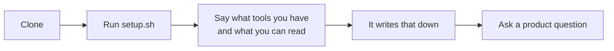
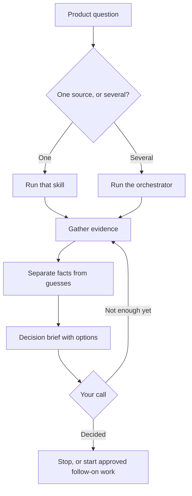
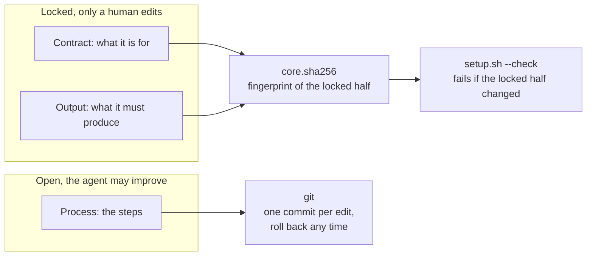
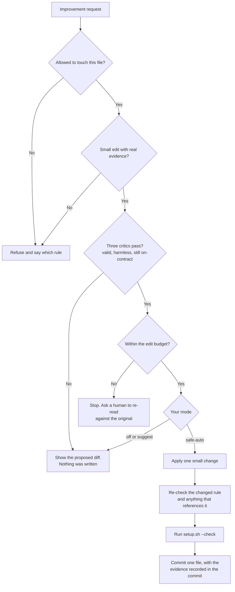
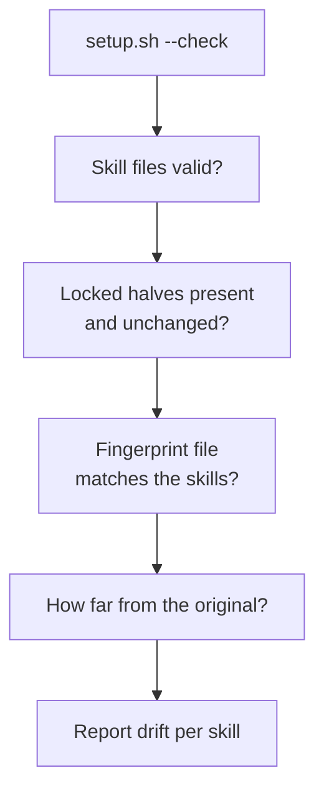

# How it works

Five things, each in plain language first and a diagram second. If you only read the plain-language parts you will still understand the system.

The five: [getting started](#1-getting-started), [answering a question](#2-answering-a-product-question), [what a skill is](#3-what-a-skill-is-made-of), [how a skill improves itself](#4-how-a-skill-improves-itself), [what the check catches](#5-what-the-check-catches).

---

## 1. Getting started

You clone the repo, run `./setup.sh`, and then have a short conversation to tell it what tools you have and what you are allowed to read. It writes that down. After that, you can ask it product questions.

The conversation matters because the system will not guess. For each source it asks four things: are you allowed to read it, what part of it, can it actually reach it, and does a small test read come back. A source that fails any of those is marked not ready, and skills say so instead of inventing an answer.

---

## 2. Answering a product question

Ask a narrow question and one skill handles it. Ask a broad one and the orchestrator runs several skills and pulls the answers together.

Either way the sequence is the same: work out what decision you are actually making, gather the smallest set of evidence that would settle it, keep facts separate from guesses, and hand you a brief with the options.

Then it stops. You make the call. It does not run the follow-on work unless you ask.

Three things happen inside "gather evidence" that are worth knowing:

- **It reuses recent work.** If a fresh evidence packet already answers part of the question, it uses that instead of pulling the source again.
- **It runs sub-agents only when they help.** Parallel work happens only when the pieces do not overlap.
- **It reports gaps instead of filling them.** If a source is not ready, you get a partial answer that names the exact gap.

---

## 3. What a skill is made of

Every skill file has two halves.

The **locked half** says what the skill is for and what it must produce. Only a human changes that. The **open half** is the steps for doing the work, and the agent may improve those.

That split is the whole idea. A skill can get better at its job without changing what its job is.

This also makes updates painless. Upstream changes land in the locked half, your own improvements sit in the open half, so a pull usually merges cleanly. If you do get a conflict, that is useful: it means an edit went somewhere it should not have.

---

## 4. How a skill improves itself

An agent that can rewrite its own instructions will slowly rewrite itself into something else. Every edit looks reasonable on its own. Fifty edits later you cannot find the one that broke it.

So every check runs **before** anything is written. If a check fails, no edit was ever made, so there is nothing to undo.

An edit has to clear four things:

1. **Is it allowed to touch this?** The charter, the locked half, the fingerprint file, and the test suite are all off limits. Asking nicely does not change that.
2. **Is it a small edit, and is there evidence?** Whole-file rewrites are refused. So are edits with no cited failure behind them. Someone saying "this would be better" is not evidence.
3. **Do the three critics pass?** Is the file still valid, does the edit weaken any rule about permissions or privacy or evidence, and does the skill still do what it originally promised.
4. **Is it within budget?** Small edits add up. Past the cap, it stops and asks a human to re-read the skill against the original, even if every other check is green.

Only then does it write, and only in the mode you chose: `off`, `suggest`, or `safe-auto`. `suggest` is the default, so nothing is edited until you turn that on.

Two details that are easy to miss:

- **The comparison is against the original, not yesterday.** Compare each edit to the one before it and every step looks small, so drift never shows. The original is pinned with a git tag called `core-origin`.
- **"No change needed" is a real answer.** If the skill already does what was asked, it says so and points at the rule, rather than adding a duplicate.

---

## 5. What the check catches

`./setup.sh --check` is the safety net. It calls no model and touches no network, so it is fast and gives the same answer every time. Run it whenever.

It fails on four things:

| It fails when | Because |
|---|---|
| A skill has no locked half, or the markers are broken | Deleting the guardrail is not a way around it |
| The locked half changed | That is a specification change, and a human makes those |
| A skill is missing from the fingerprint file, or listed but gone | The list and the skills have to agree |
| A skill has drifted too far from the original | Catches slow drift that each individual edit stayed under |

Two more checks take an argument, so you run them yourself:

- `evals/check-output.sh <skill> <artifact>` checks a produced document against the fields its skill promised. A missing field fails and names it.
- `evals/test-guardrails.sh` checks that all of the above actually fail when they should. It works on a throwaway copy, so it cannot damage anything.

---

## The honest limit

Anyone with terminal access, the agent included, can regenerate the fingerprint file and make an edit look approved. Nothing here stops that.

What it does is make the attempt visible in the diff, so a human reviewing the change can see it. That is a real limit, and it is written down rather than papered over.
