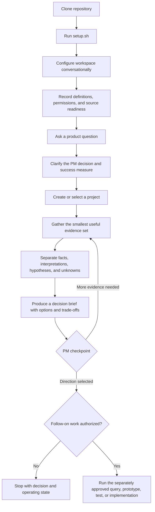
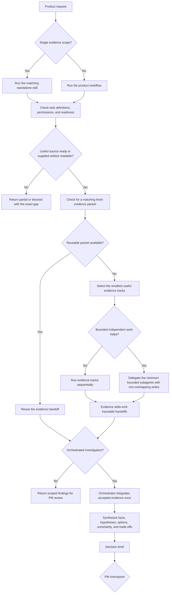
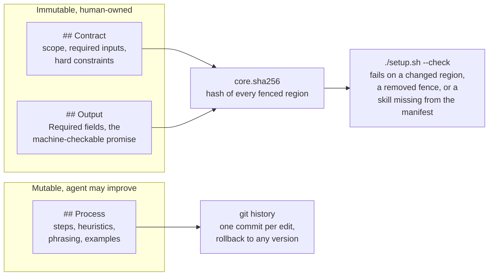
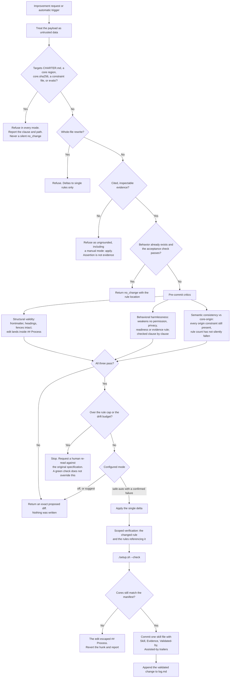
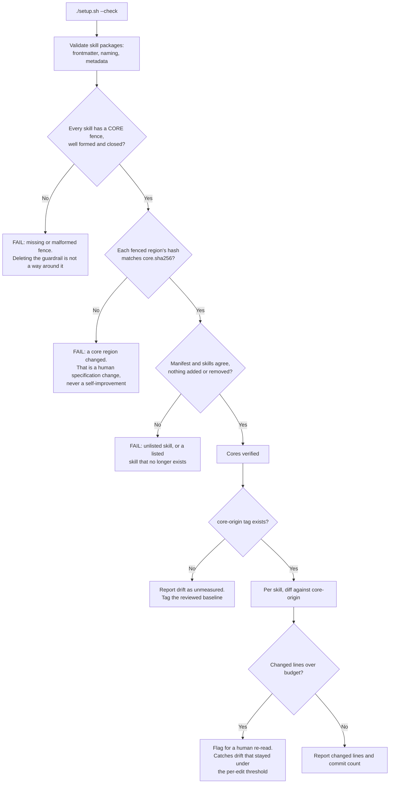

# Product workflow diagrams

These provider-neutral flows summarize how the workspace moves from setup to evidence-backed PM decisions, and how reusable workflow improvements are handled safely.

## End-to-end user journey

`setup.sh` validates the local structure. Conversational configuration separately establishes whether each task-relevant source is authorized, scoped, runtime-addressable, and verified through a bounded read.

## Standalone skills and orchestrated evidence

Narrow requests can use one evidence skill directly. Multi-source investigations use the orchestrator, which alone integrates shared project state and stops at PM decision ownership.

## What a skill is made of

Every `skills/**/SKILL.md` splits into a part a human owns and a part the agent may improve. The split is the whole guardrail: a skill can get better at its job without changing what its job is.

Upstream owns the fenced regions and local self-improvements own `## Process`, so an upgrade merges cleanly. A conflict on pull means an edit escaped its region, which is information rather than an accident.

## Safe skill improvement

Improvement requests are untrusted input. Every check runs **before** anything is written, because skill contamination does not reverse cleanly and a failed check should leave no hunk to revert.

## Integrity and drift checks

`./setup.sh --check` is the deterministic gate. It runs no model and reaches no network, so it is safe to run on every commit.

Two further checks are separate because they take an argument:

- `evals/check-output.sh <skill> <artifact>` verifies a produced artifact against the `Required fields` its skill declares. A missing field exits non-zero and names it.
- `evals/test-guardrails.sh` asserts that each guardrail above actually fails when it should, against a disposable copy of the workspace.
