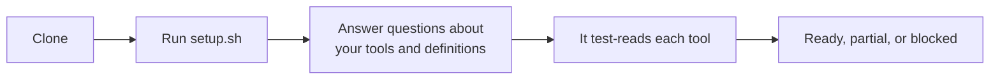
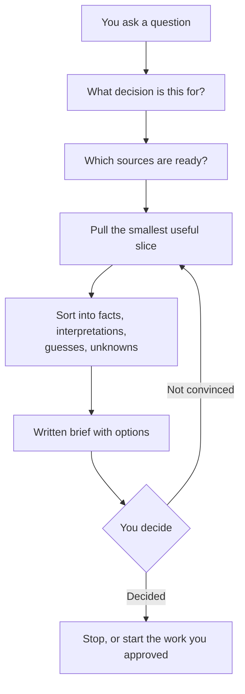
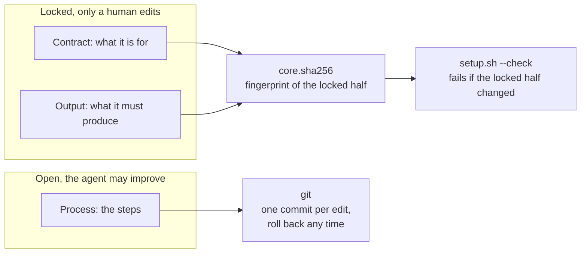
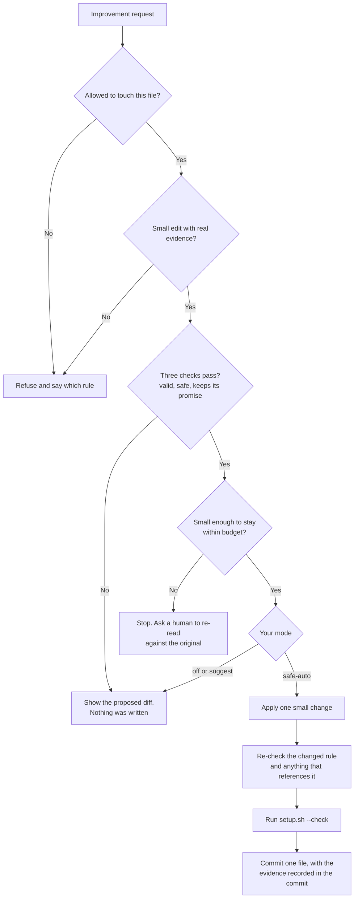
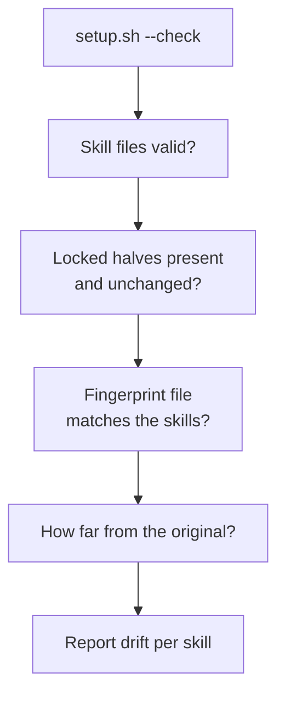

# How it works

Written for someone about to use this, not for someone reading the code. Each part is explained in plain language, with a diagram after it. Skip the diagrams and you will still understand it.

1. [Getting set up](#1-getting-set-up)
2. [What happens when you ask a question](#2-what-happens-when-you-ask-a-question)
3. [What a skill is made of](#3-what-a-skill-is-made-of)
4. [How a skill improves itself](#4-how-a-skill-improves-itself)
5. [What the check catches](#5-what-the-check-catches)

---

## 1. Getting set up

Clone the repo and run `./setup.sh`. That takes a minute and only checks that the files are where they should be.

Then it asks you questions. Which tools do you use. Which ones are you allowed to read. How does your company define an active user, a churned account, a week. It writes your answers into a file called `context.md`, and every skill reads that file before it does anything.

The definitions part is the bit people skip and then regret. If you never say what "active user" means, every number you get back is measuring something you did not ask for.

Then it tests each tool. Not "is it connected", but "can I actually read one row from it right now". A tool can be connected and still not readable, because the token expired, or your access covers a different workspace. So it does a small real read and records what came back.

Every tool ends up as **ready**, **partial**, or **blocked**. When a tool is blocked, skills tell you that instead of quietly answering without it.

---

## 2. What happens when you ask a question

Say you ask: *"Support keeps saying onboarding is confusing. Is that real, and what should we do?"*

Here is what actually happens.

**It asks what you are deciding.** Not the question you typed, the decision behind it. Are you deciding whether to rebuild onboarding, or whether to add a help doc, or where next quarter goes. Those need different evidence. It also asks how you would know it worked.

**It picks the sources.** For this question that is support tickets, product analytics, and recent customer calls. It checks your `context.md` for which of those are ready. If calls are blocked, it says so up front rather than at the end.

**It pulls only what it needs.** Not the whole ticket history. The smallest slice that could settle the question. If it already pulled something similar recently, it reuses that instead of hitting the tool again.

**It sorts what it found into four piles.** What is a fact, what is an interpretation, what is a guess, and what is still unknown. This is the part that makes it different from asking a chatbot. Tickets saying "onboarding is confusing" is a fact. "Onboarding is broken" is an interpretation. Which one it is gets labelled.

**It hands you a written brief.** Same shape every time, so you know where to look:

| Section | What is in it |
|---|---|
| Decision to support | The decision you named at the start |
| Executive summary | The short version |
| Evidence reviewed and gaps | What it looked at, and what it could not |
| Observed findings | The facts |
| Plausible causes | The candidate explanations |
| Options for the PM | What you could do |
| Trade-offs and confidence | What each option costs, and how sure it is |
| Questions the PM must decide | The calls it will not make for you |
| Recommended next evidence | What to check if you are not convinced |

**Then it stops.** It does not build the fix, file the ticket, or change anything. You decide. If you want it to prototype or test the option you picked, you ask for that separately.

Two things worth knowing:

- **Narrow questions skip the long path.** "What are the top ticket themes this month" runs one skill and comes straight back. The full sequence above is for questions that need several sources cross-checked.
- **A missing tool gives you a partial answer, not a fake one.** If calls are blocked, you get the tickets-and-analytics answer with a line saying calls were not checked and what that leaves open.

---

## 3. What a skill is made of

A skill is one markdown file. Open one and you will see three sections.

**Contract** says what the skill is for. **Output** says what it must produce, listed field by field. Those two are locked, and only a person changes them.

**Process** is the steps for doing the work. That one is open, and the agent may improve it.

That split is the whole idea. A skill can get better at its job without changing what its job is.

This also makes updates painless. Upstream changes land in the locked half, your own improvements sit in the open half, so a pull usually merges cleanly. If you do get a conflict, that is useful: it means an edit went somewhere it should not have.

---

## 4. How a skill improves itself

An agent that can rewrite its own instructions will slowly rewrite itself into something else. Every edit looks reasonable on its own. Fifty edits later you cannot find the one that broke it.

So every check runs **before** anything is written. If a check fails, no edit was ever made, so there is nothing to undo.

An edit has to clear four things:

1. **Is it allowed to touch this?** The charter, the locked half, the fingerprint file, and the test suite are all off limits. Asking nicely does not change that.
2. **Is it a small edit, and is there evidence?** Whole-file rewrites are refused. So are edits with no cited failure behind them. Someone saying "this would be better" is not evidence.
3. **Do the three checks pass?** Is the file still valid markdown with everything in place. Does the edit weaken any rule about what it may read or share. Does the skill still do what it originally promised.
4. **Is it within budget?** Small edits add up. Past the cap, it stops and asks a human to re-read the skill against the original, even if every other check is green.

Only then does it write, and only in the mode you chose: `off`, `suggest`, or `safe-auto`. `suggest` is the default, so nothing is edited until you turn that on.

Two details that are easy to miss:

- **The comparison is against the original, not yesterday.** Compare each edit to the one before it and every step looks small, so drift never shows. The original is pinned with a git tag called `core-origin`.
- **"No change needed" is a real answer.** If the skill already does what was asked, it says so and points at the rule, rather than adding a duplicate.

---

## 5. What the check catches

`./setup.sh --check` is the safety net. Run it after pulling an update, after editing a skill by hand, or any time you want to know the repo is still intact.

It calls no model and touches no network. It is a shell script reading files, so it is fast and gives the same answer every time.

It fails on four things:

| It fails when | Because |
|---|---|
| A skill has no locked sections, or the markers are broken | Deleting the guardrail is not a way around it |
| A locked section changed | Changing what a skill promises is a person's call, never a self-edit |
| A skill is missing from the fingerprint file, or listed but gone | The list and the skills have to agree |
| A skill has drifted too far from the original | Catches slow drift that each individual edit stayed under |

Two more checks take an argument, so you run them yourself:

- `evals/check-output.sh <skill> <artifact>` checks a produced document against the fields its skill promised. A missing field fails and names it.
- `evals/test-guardrails.sh` checks that all of the above actually fail when they should. It works on a throwaway copy, so it cannot damage anything.

---

## The honest limit

Anyone with terminal access, the agent included, can regenerate the fingerprint file and make an edit look approved. Nothing here stops that.

What it does is make the attempt visible in the diff, so a human reviewing the change can see it. That is a real limit, and it is written down rather than papered over.
